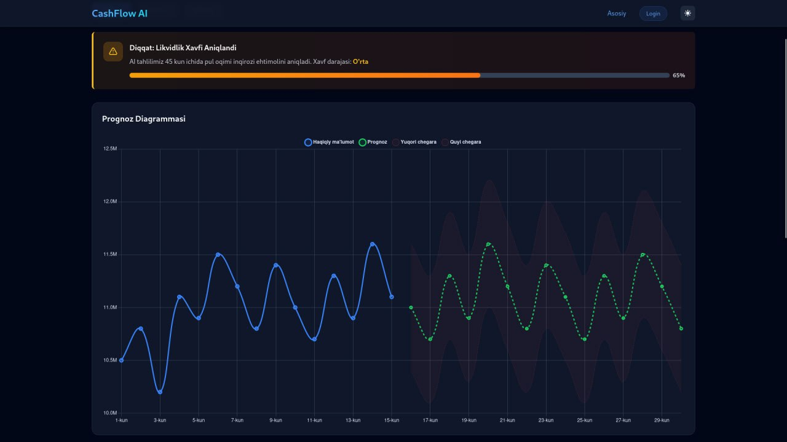
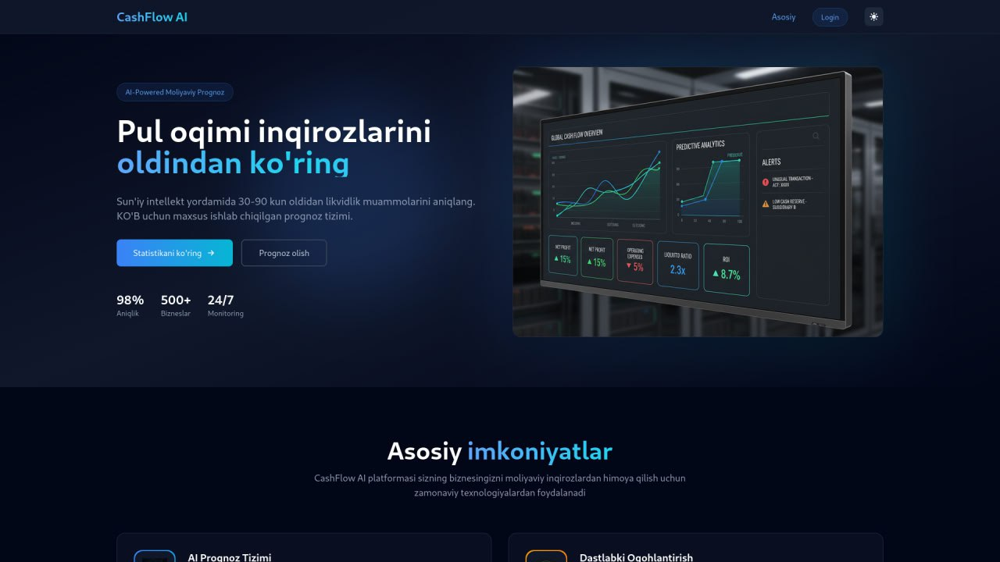
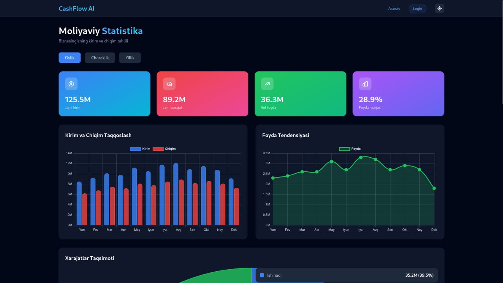

# CashFlow AI - Financial Forecasting System

🚀 **AI-powered cash flow forecasting and stress testing platform for financial institutions**

## 📋 Overview

CashFlow AI is a sophisticated financial forecasting system that leverages artificial intelligence to predict cash flow patterns and perform stress testing scenarios. Built with Laravel, Vue.js, and integrated with Ollama AI server for intelligent forecasting.

## 🖼️ Application Screenshots





## ✨ Features

### 🤖 AI Forecasting
- **Intelligent Predictions**: Uses AI models to analyze historical cash flow data
- **Multi-month Forecasts**: Generate predictions for 1-12 months ahead
- **Risk Assessment**: Automatic risk level calculation (low/medium/high)
- **Confidence Scores**: AI provides confidence levels for each prediction

### 🧪 Stress Testing
- **Scenario Analysis**: Test various financial crisis scenarios
- **Risk Evaluation**: Assess company resilience under different conditions
- **Survival Analysis**: Calculate how long company can withstand financial stress
- **Actionable Recommendations**: Get specific recommendations based on test results

### 📊 Dashboard & Analytics
- **Real-time Monitoring**: Live cash flow tracking
- **Interactive Charts**: Beautiful visualizations with Chart.js
- **Historical Analysis**: View trends and patterns over time
- **Multi-company Support**: Manage multiple companies in one platform

## 🛠️ Tech Stack

### Backend
- **Laravel 12** - PHP Framework
- **MySQL 8.0** - Database
- **Docker** - Containerization
- **Ollama** - AI Server (llama3.2 model)

### Frontend
- **Vue.js 3** - JavaScript Framework
- **Vite** - Build Tool
- **TailwindCSS** - CSS Framework
- **Chart.js** - Data Visualization

### Infrastructure
- **Docker Compose** - Multi-container orchestration
- **Nginx** - Web Server
- **PHP-FPM** - Application Server

## 🚀 Quick Start

### Prerequisites
- Docker & Docker Compose
- Node.js 18+ (for local development)
- Ollama AI Server (optional, can use remote)

### 🎯 One-Command Setup

**The easiest way to get started:**

```bash
git clone <repository-url>
cd hackathon
make run
```

That's it! 🎉 The application will be fully running at `http://localhost:8021`

### 📋 Available Commands

```bash
# Complete setup and run (recommended)
make run              # Install everything + start application

# Development commands
make dev              # Frontend hot reload server
make build            # Build production assets
make logs             # View application logs

# Database commands
make migrate          # Run database migrations
make seed             # Seed with sample data
make fresh            # Fresh install (migrate + seed)

# Container management
make start            # Start containers
make stop             # Stop containers
make kill             # Force stop + remove everything
make restart          # Restart containers

# Utility commands
make perms            # Fix file permissions
make clean            # Clean up containers and cache
make help             # Show all available commands
```

## 🏗️ Architecture

### Service Layer
```
Controller (HTTP Layer)
    ↓
Service (Business Logic)
    ↓
Model (Data Layer)
    ↓
Database
```

### Key Services
- **ForecastService**: AI-powered cash flow forecasting
- **StressTestService**: Financial stress testing and analysis
- **CompanyService**: Company management operations

### API Endpoints

#### AI Forecasting
- `POST /api/ai/forecast/generate` - Generate forecasts
- `GET /api/ai/forecast/{company_id}` - Get forecast data
- `DELETE /api/ai/forecast/{company_id}` - Delete forecasts

#### Stress Testing
- `POST /api/stress-test/run` - Run stress tests
- `GET /api/stress-test/results/{company_id}` - Get test results
- `GET /api/stress-test/scenarios` - Get scenario templates

## 📖 API Documentation

### AI Forecast API
See [AI_FORECAST_API.md](src/AI_FORECAST_API.md) for detailed API documentation.

### Stress Test API
See [STRESS_TEST_API.md](src/STRESS_TEST_API.md) for stress testing documentation.

## 🔧 Configuration

### Environment Variables
Key environment variables in `.env`:

```env
# Database
DB_CONNECTION=mysql
DB_HOST=db
DB_DATABASE=hackatonCo_b
DB_USERNAME=admin
DB_PASSWORD=secret

# AI Server
AI_SERVER_URL=http://localhost:11434/api/generate
AI_MODEL=llama3.2
AI_TIMEOUT=60
AI_TEMPERATURE=0.3

# Application
APP_URL=http://localhost:8021
APP_ENV=local
APP_DEBUG=true
```

### AI Server Setup

#### Using Ollama (Recommended)
```bash
# Install Ollama
curl -fsSL https://ollama.ai/install.sh | sh

# Start Ollama server
ollama serve

# Pull the model
ollama pull llama3.2
```

#### Alternative AI Services
Update `AI_SERVER_URL` in `.env` to use:
- OpenAI API
- Claude API
- Custom AI endpoints

## 🧪 Testing

### Running Tests
```bash
make test              # Run PHPUnit tests
```

### Manual Testing
```bash
# Test AI forecast
curl -X POST http://localhost:8021/api/ai/forecast/generate \
  -H "Content-Type: application/json" \
  -d '{"company_id": 1, "months_to_predict": 6}'

# Test stress testing
curl -X POST http://localhost:8021/api/stress-test/run \
  -H "Content-Type: application/json" \
  -d '{"company_id": 1}'
```

## 📊 Data Models

### Core Models
- **Company**: Company information and settings
- **CashflowSummary**: Historical cash flow data
- **Forecast**: AI-generated predictions
- **StressTest**: Stress test results and scenarios

### Database Schema
See `src/database/migrations/2026_01_21_062405_create_full_fintech_schema.php` for complete schema.

## 🔒 Security

### Authentication
- Laravel Sanctum for API authentication
- CSRF protection for web routes
- SQL injection prevention

### Data Protection
- Encrypted sensitive data
- Secure file permissions
- Environment variable protection

## 🚀 Deployment

### Production Deployment
```bash
# Deploy to production
make deploy

# Production monitoring
make monitor
```

### Environment Setup
1. Configure production `.env` file
2. Set up SSL certificates
3. Configure domain and DNS
4. Set up monitoring and logging

## 📈 Performance

### Optimization
- Docker multi-stage builds
- Asset minification and compression
- Database query optimization
- Redis caching (optional)

### Monitoring
- Application logs via `make logs`
- Container resource monitoring
- Database performance tracking

## 🤝 Contributing

### Development Workflow
1. Fork the repository
2. Create feature branch
3. Make changes
4. Run tests
5. Submit pull request

### Code Standards
- Follow PSR-12 coding standards
- Use Laravel best practices
- Write comprehensive tests
- Document new features

## 📞 Support

### Common Issues

#### Database Connection Errors
```bash
make perms            # Fix permissions
make migrate          # Reset database
```

#### AI Server Issues
```bash
make ai-start         # Start AI server
curl http://localhost:11434/api/generate  # Test AI server
```

#### Container Issues
```bash
make kill            # Clean slate
make run             # Fresh start
```

### Getting Help
- Check this README first
- Review API documentation
- Check application logs with `make logs`
- Review Makefile commands with `make help`

## 📄 License

This project is licensed under the MIT License - see the [LICENSE](LICENSE) file for details.

## 🙏 Acknowledgments

- **Laravel** - Amazing PHP framework
- **Ollama** - Open-source AI server
- **Vue.js** - Progressive JavaScript framework
- **TailwindCSS** - Utility-first CSS framework
- **Chart.js** - Beautiful charting library

---

## 🎯 Quick Reference

### Essential Commands
```bash
make run              # Start everything (most used)
make dev              # Frontend development
make logs             # View logs
make kill             # Clean up everything
make help             # Show all commands
```

### URLs
- **Application**: http://localhost:8021
- **AI Server**: http://localhost:11434 (if using Ollama)
- **Database**: localhost:3321

### File Locations
- **Configuration**: `src/.env`
- **Docker Setup**: `docker-compose.yml`
- **Commands**: `Makefile`
- **API Docs**: `src/AI_FORECAST_API.md`, `src/STRESS_TEST_API.md`

---

**Built with ❤️ for financial institutions** 🏦
